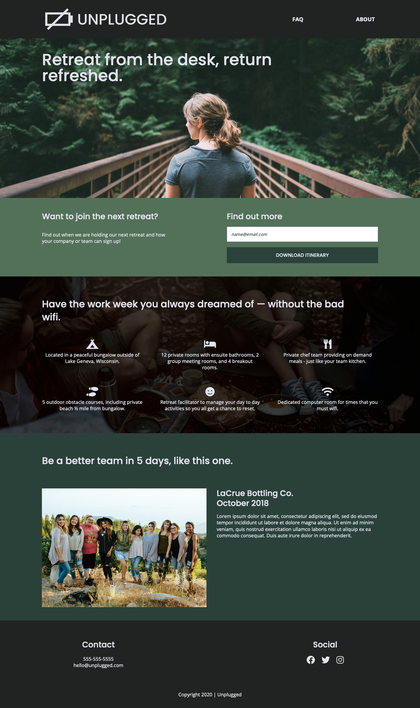
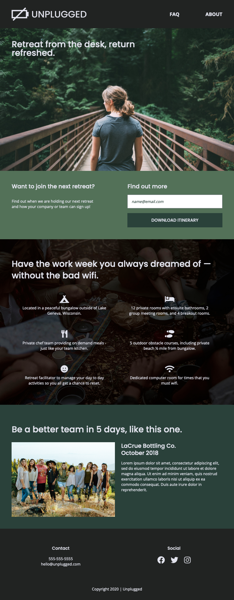
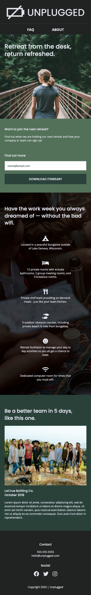

# Unplugged Tech Retreat Website

## Table of contents

- [Overview](#overview)
  - [Screenshot](#screenshot)
  - [Links](#links)
  - [Built with](#built-with)
  - [Continued development](#continued-development)
- [Author](#author)

## Overview
For this project, I recreated a three-page website based on a Photoshop design. The design included layouts for mobile, tablet, and desktop screens. The site features internal navigation links and social media icons. Additionally, the site has an interactive map of the location included.

### Screenshot

### Links

- Live Site URL: (https://stacy-riley.github.io/tech-retreat/)

### Built with

- Semantic HTML5 markup
- CSS
- Mobile-first workflow

### Continued development

I would like to use more maps in future projects as well as more interactive elements within the pages.

## Author

- Website - [Stacy Riley](https://www.createdbystacy.com)